## Descripción

Mapa de donde se muestran los sitios de interes cultural de bogotá incluidos monumentos.

##  Cuál es el problema a tratar ?
Se pretende visualizar de manera facil para el usuario final los diferentes sitios de interés de la ciuadad. En este caso turistas o personas que quieran dar un paseo por la ciudad de Bogotá, Se mostrará en el mapa sitios de interés como monumentos y equipamientos culturales. 

##  Por qué un mapa ayuda a resolverlo?
Mediante la utilización de un mapa en la web, se puede consultar de manera interactiva los diferentes sectores de la ciudad. Al hacer zoom a un determinado sector, se va visualizando mas información que puede ser de interes, como el nombre del lugar, al tiempo las vias principales cercanas y el nombre de la localidad

## Fuente de datos

Datos abiertos Bogotá: shapefiles obtenidos de la gdb de IDECA.

##  Herramientas

- QGIS
- Geoserver
- Postgis

##  Proceso Realizado

- Una vez obtenidas las capas en formato shape, se cargan en Qgis 3x mediante la base de datos "clase_carto_web" usando el servidor postgis suministrado a la clase.

Para localidad:

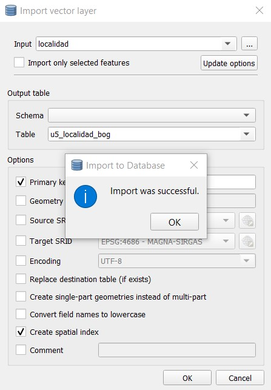

Para monumentos:

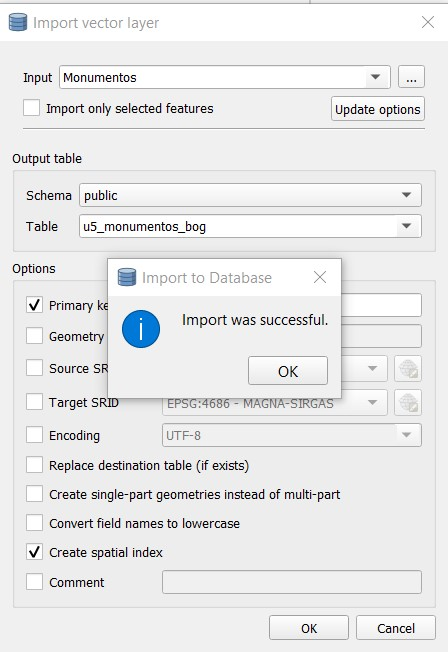

Para equipamientos:

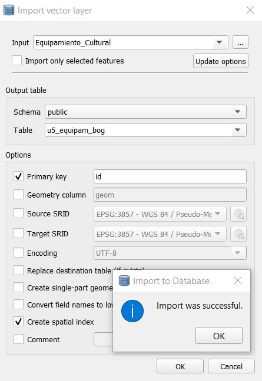

- Se procede a configurar las propiedades de visualización para las diferentes capas cargadas, buscando que se vean solamente cuando se haga zoom menor dependiendo el tema.

Para localidad:

La configuración de simbologia de texto
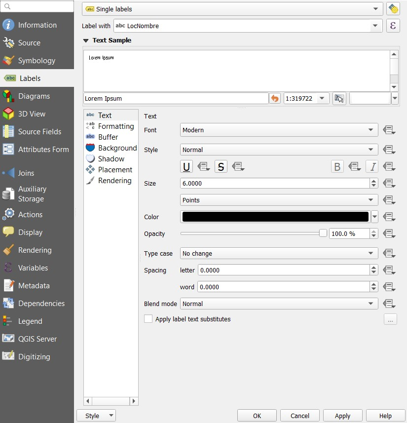

La configuración de zoom:
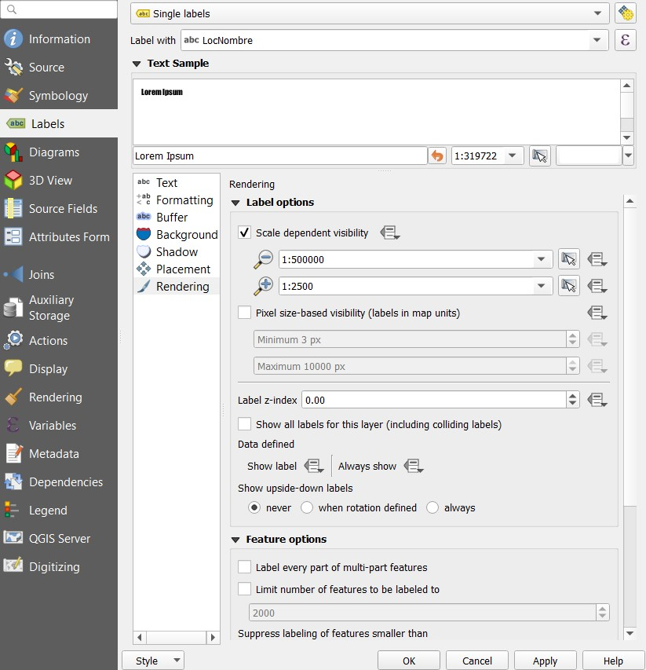

La simbología categorizada por nombre:
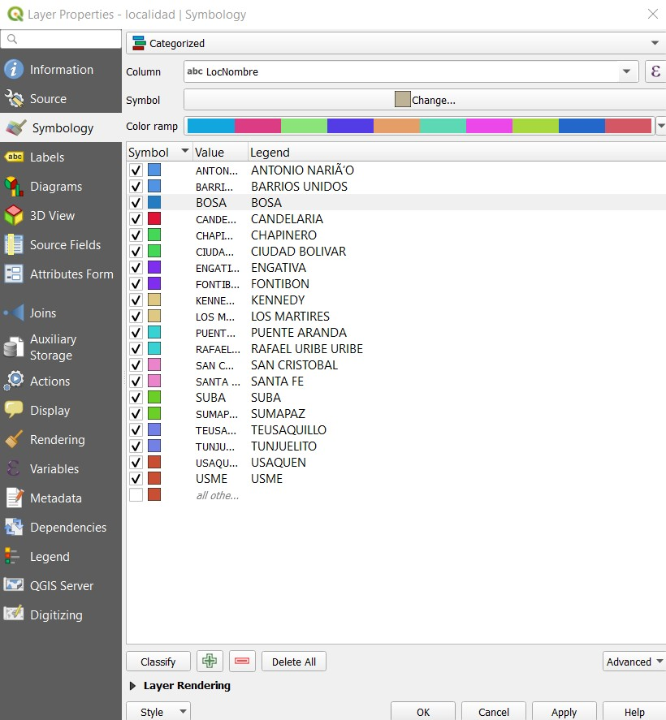

Ahora, se exportan estos simbolos a formato SLD para ser leidos en geosever.

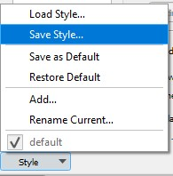

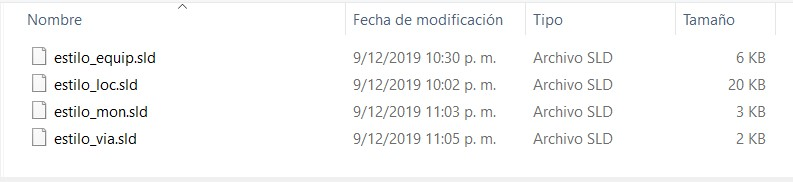

## Carga de datos a geoserver

Se procede a la carga de las capas subidas desde Qgis 3.x via postgis. Se realiza el mismo procedimiento para las cuatro capas.

Se muestra la subida de la capa equipamiewntos:

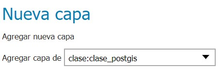

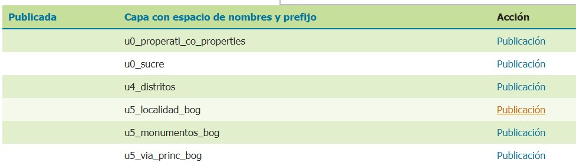

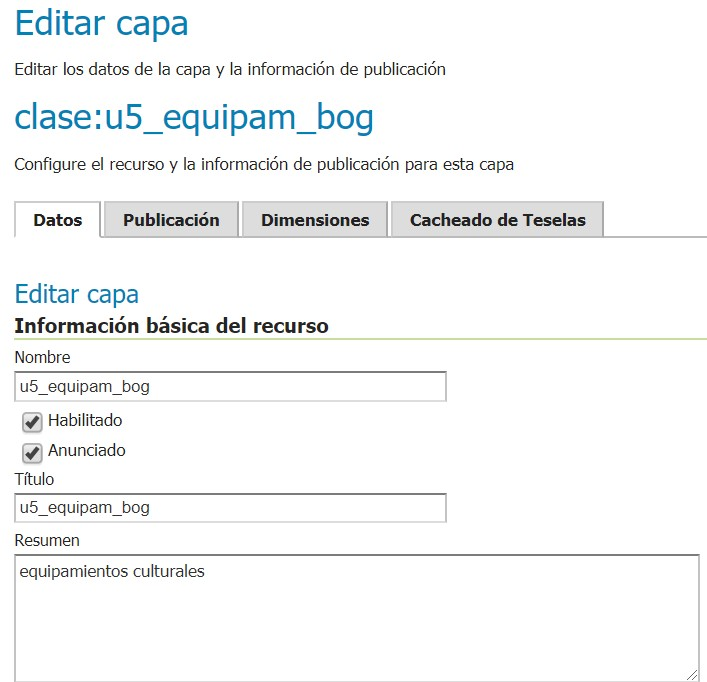

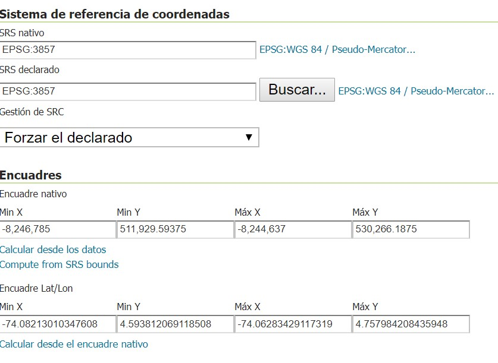

##  Urls

- 

