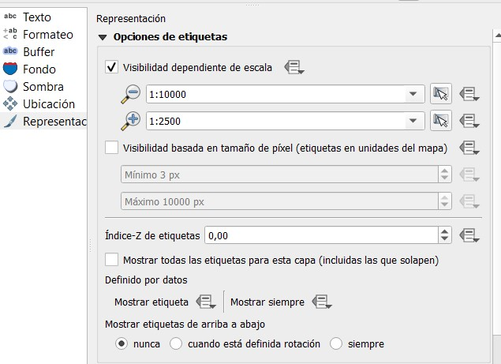
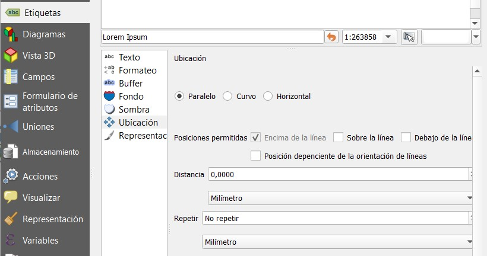
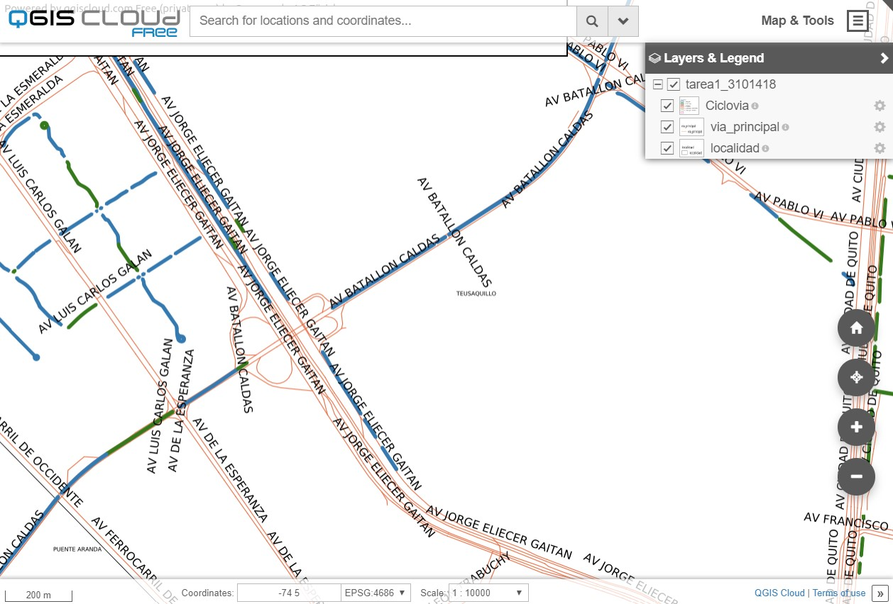
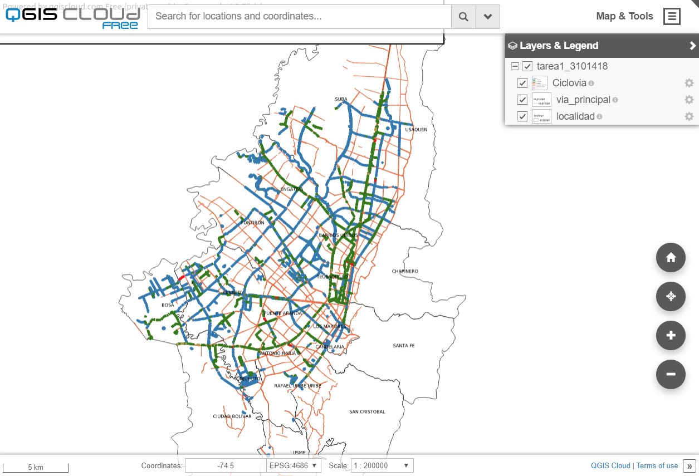

## Descripción

Mapa de donde se muestran los sitios de interes cultural de bogotá incluidos monumentos.

##  Cuál es el problema a tratar ?
Se pretende visualizar de manera facil para el usuario final los diferentes sitios de interés de la ciuadad. En este caso turistas o personas que quieran dar un paseo por la ciudad de Bogotá, Se mostrará en el mapa sitios de interés como monumentos y equipamientos culturales. 

##  Por qué un mapa ayuda a resolverlo?
Mediante la utilización de un mapa en la web, se puede consultar de manera interactiva los diferentes sectores de la ciudad. Al hacer zoom a un determinado sector, se va visualizando mas información que puede ser de interes, como el nombre del lugar, al tiempo las vias principales cercanas y el nombre de la localidad

## Fuente de datos

Datos abiertos Bogotá: shapefiles obtenidos de la gdb de IDECA.

##  Herramientas

- QGIS
- Geoserver
- Postgis

##  Proceso Realizado

- Una vez obtenidas las capas en formato shape, se cargan en Qgis 3x mediante la base de datos "clase_carto_web" usando el servidor postgis suministrado a la clase.

Para localidad:

Para monumentos:

Para equipamientos:

- Se procede a configurar las propiedades de visualización para las diferentes capas cargadas, buscando que se vean solamente cuando se haga zoom menor dependiendo el tema.

- Se procede a generar el servicio geografico WMS mediante la carga usando el software libre Qgis Cloud, se actualizan las capas y se cargan los datos:

Para localidad:

- Una vez cargados los datos, aparece una previsualización del mapa web:

- Haciendo zoom +, se puede ver la información con mas de detalle , incluyendo el nombre de la vía.

- Finalmente, se puede ver el servicio publicado en la web:

##  Urls

- Mapa Web Clicovias
https://qgiscloud.com/wilsonpc_geomatica/tarea1_3101418/?bl=&st=&l=localidad%2Cvia_principal%2CCiclovia&t=tarea1_3101418&e=-74.19761%2C4.58665%2C-74.00573%2C4.71724

- Mapa web Hot Spot de eventos de remoción.
https://qgiscloud.com/wilsonpc_geomatica/tarea1_3101418_evento_rem2/?bl=&st=&l=localidad%2Chs_remoc&t=tarea1_3101418_evento_rem2&e=-0.00017%2C-0.00008%2C0.00017%2C0.00008
