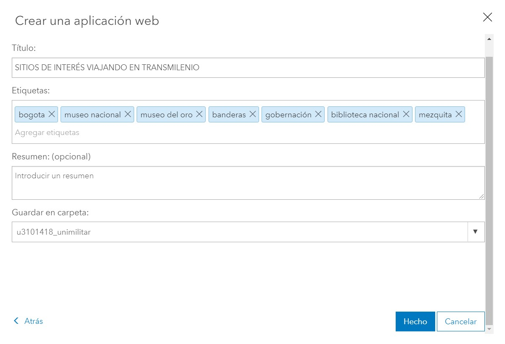

## Descripción

Creación de un mapa que cuenta una historia sobre como conocer algunos sitios de interés de la ciudad de Bogotá, Usando el transporte público de transmilenio.

##  Cuál es el problema a tratar ?
Se plantea un problema de algunas personas que llegan a la ciudad o viven en ella, pero no conocen los lugares icónicos. Por lo que se ofrece esta herramienta tecnológica que mediante mapas , imagenes y textos, se muestra la ubicación de algunos lugares de interés cultural de la ciudad.

## Fuente de datos

Datos abiertos Bogotá: shapefiles obtenidos de la gdb de IDECA.

##  Herramientas

- Arcmap 10.5
- Arcgis on line
- App builder

##  Proceso Realizado

El trabajo realizado se divide en varias fases:

- Recolección de mapas temáticos
- Carga a arcgis on line
- Edición de mapas
- subida de imagenes
- Edicicion en app builder.

## Recolección de la información 

Usando el portal de mapas abiertos de Bogotá
https://datosabiertos.bogota.gov.co/dataset?groups=transporte.

Se descargaron las capas en formato shape de lineas de transmilenio y de estaciones. La tercera capa usada resultó de la edición donde se seleccionó las estaciones de interés.

## Carga a Arcgis on line

Se procede a subir las capas a la nube de arcgis on line.

## Edición de mapas

Usando las diferentes capas ya alojadas en arcgis online, se arma un mapa configurando, colores, simbolos y etiquetas.

Quedando los siguientes mapas creados.

## Subida de imagenes

De igual manera, se debe colectar imagenes relacionadas a los sitios de interés y posteriormente subirlas a arcgis online, para luego ser incluidas en el Story Map.

## Edición en App Builder

Para la realización de esta historia en mapas, se edito mediante App Builder de arcgis on line.

Finalmente, se edita la app, cargando los mapas elaborados anteriormente, agregando las imagenes y escribiendo un texto que en este caso se basó en las páginas web relacionadas. Todas las fuentes fueron referenciadas.

Al final, se procede a publicar verificando los permisos a quien va dirigido.

## Ventajas , desventajas y dificultades

- La ventaja principal de este tipo de softwarees que es de facil uso, muy estable, hay garantia de que se podrá publicar y difundir.

- La principal desventaja es que el software no es p+ublico y el costo es bastante elevado.

- La principal dificultad para la elaboracion del presente trabajo es el corto tiempo para la elaboración.

##  Url

-  http://arcg.is/yWDuq
