## Descripción

Mapa de donde se muestran los trazados de las ciclo rutas de la ciudad de Bogotá, describiendo el tipo de material en el que está hecha

##  Cuál es el problema a tratar?

Ubicación de ciclorutas de toda la ciudad, ubicando localidades de la ciudad, vias principales y sectores donde se ubican dichas vías según el material de lo que están hechas. 

##  Por qué un mapa ayuda a resolverlo?

Mediante la ubicación geográfica es fundamental para la mayoría de las actividades humanas. En este caso, el uso de un mapa que permita mostar donde hay ciclorutas, permite a los ciclistas identificar las mejores rutas para llegar a sus destinos. Esto redunda en mejora de la calidad de vida, mejora el ambiente porque evita que algunos ciudadanos usen vehículos de combustión interna.

## Fuente de datos

Datos abiertos Bogotá: shapefiles obtenidos de la gdb de IDECA.

##  Herramientas
- QGIS
- QgisCloud

##  Proceso Realizado

- Se creó cuenta gratuita en QgisCloud https://qgiscloud.com/
- En QGIS se instaló del plugin de qgiscloud
- Una vez obtenidas las capas en formato shape, se cargan en Qgis 3x.

- Se procede a configurar la simbología de la capa de ciclo rutas.

- Se editan las propiedades para la localidad en cuanto a texto, asignando tamaño, color, escala de visualización, entre otras:

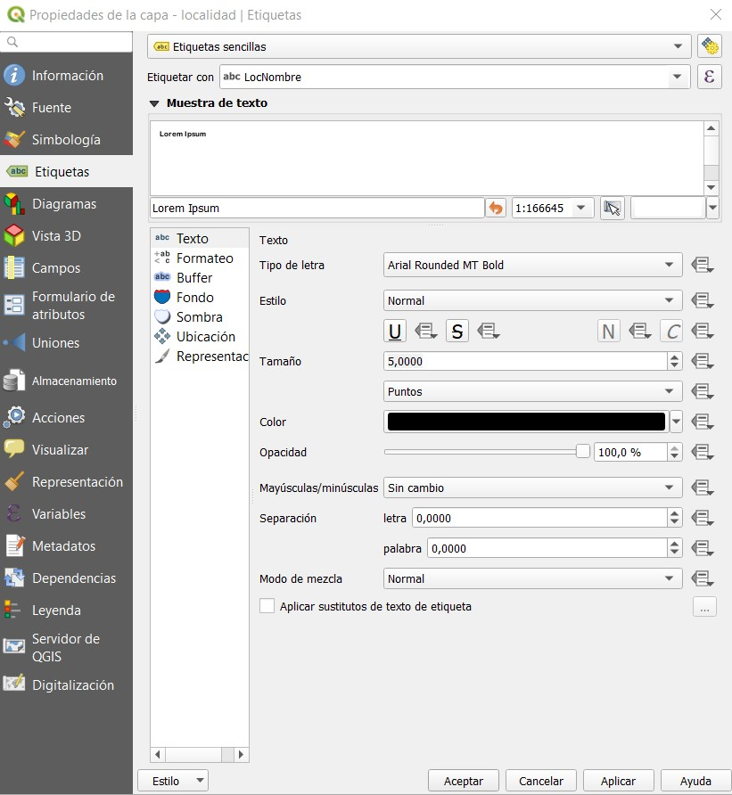

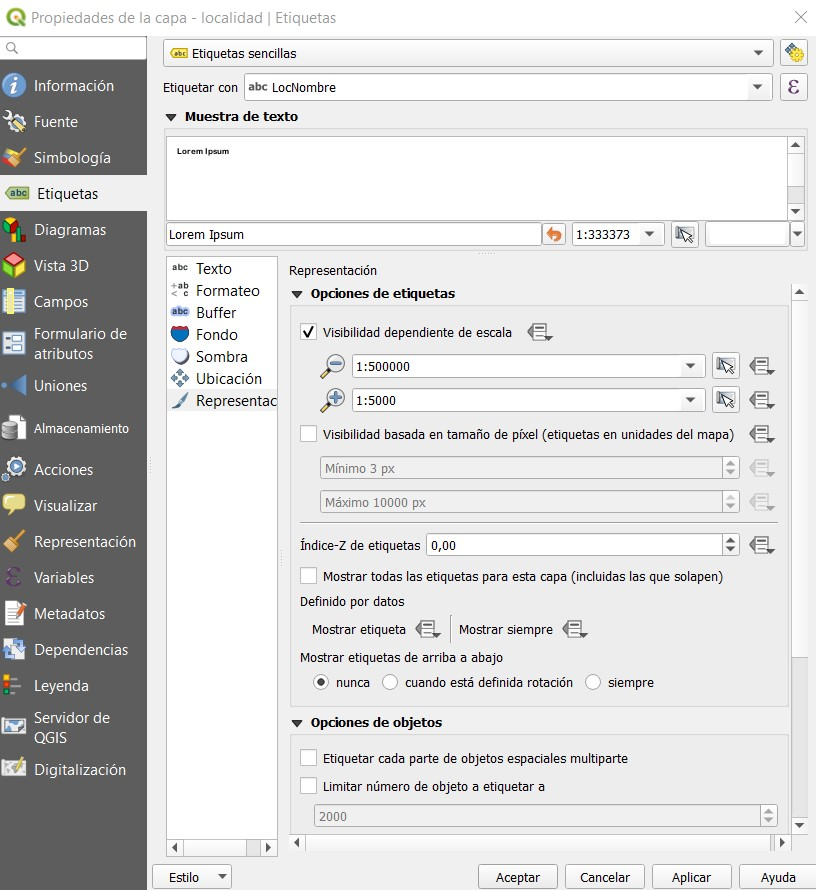

- De igual manera, se procede a configurar las propiedades de visualización para la capa de vias principales, de manera que muestren textos solamente cuando se haga zoom menor a 1:10.000 y el texto debe ir paralelo a las lineas de la via:

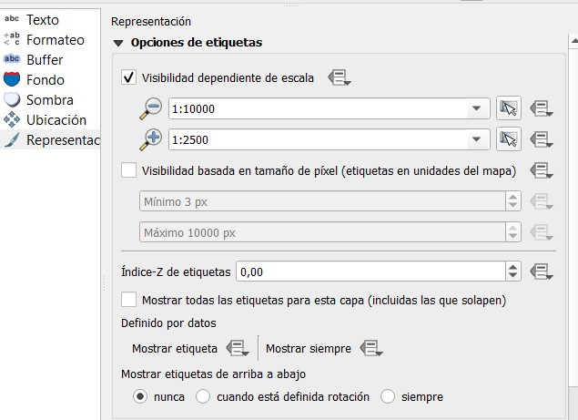

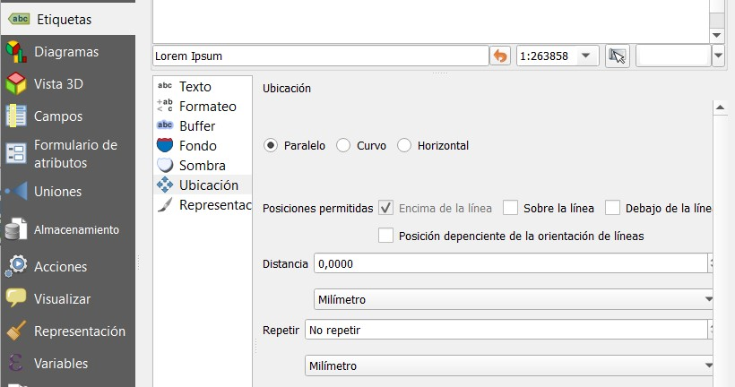

- Una vez obtenido el mapa en Qgis, se procede a generar el servicio geografico WMS mediante la carga usando el software libre Qgis Cloud, se actualizan las capas y se cargan los datos:

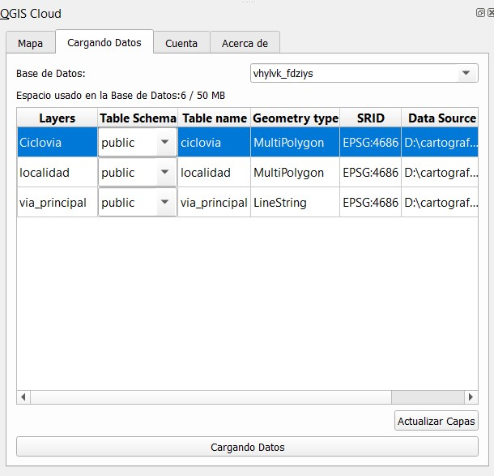

- Una vez cargados los datos, aparece una previsualización del mapa web:

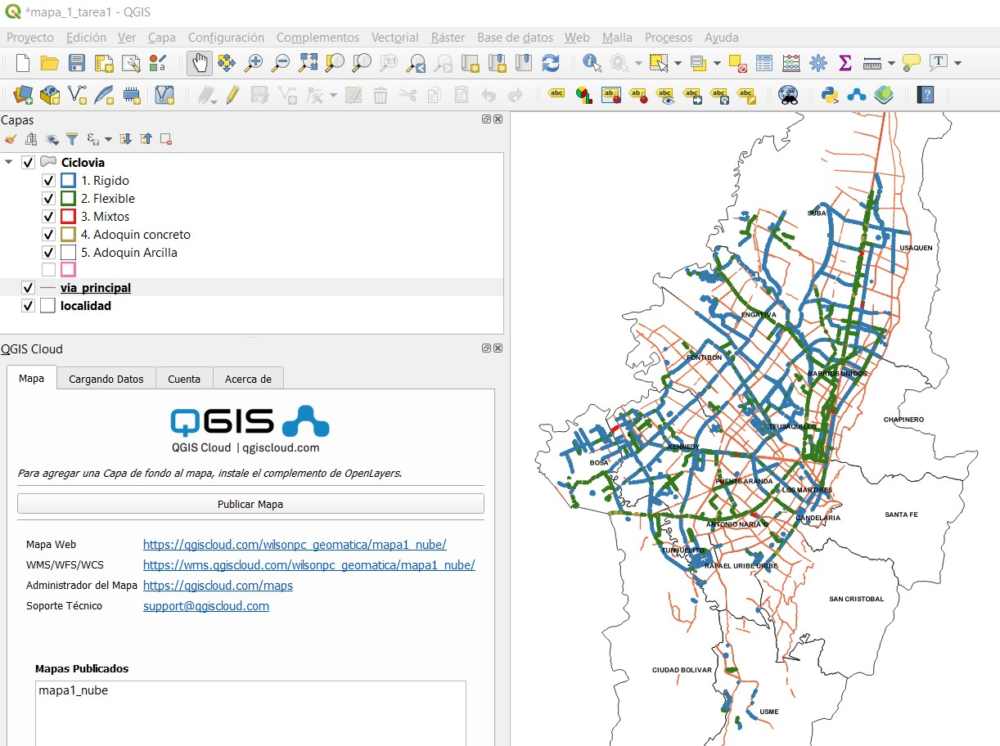

- Haciendo zoom +, se puede ver la información con mas de detalle , incluyendo el nombre de la vía.

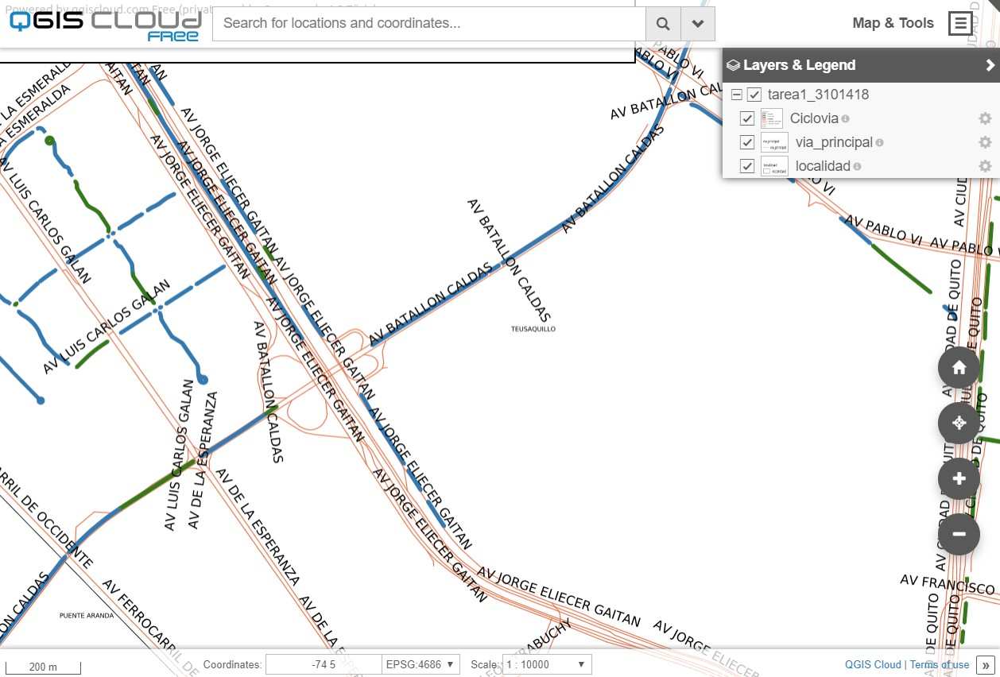

- Finalmente, se puede ver el servicio publicado en la web:

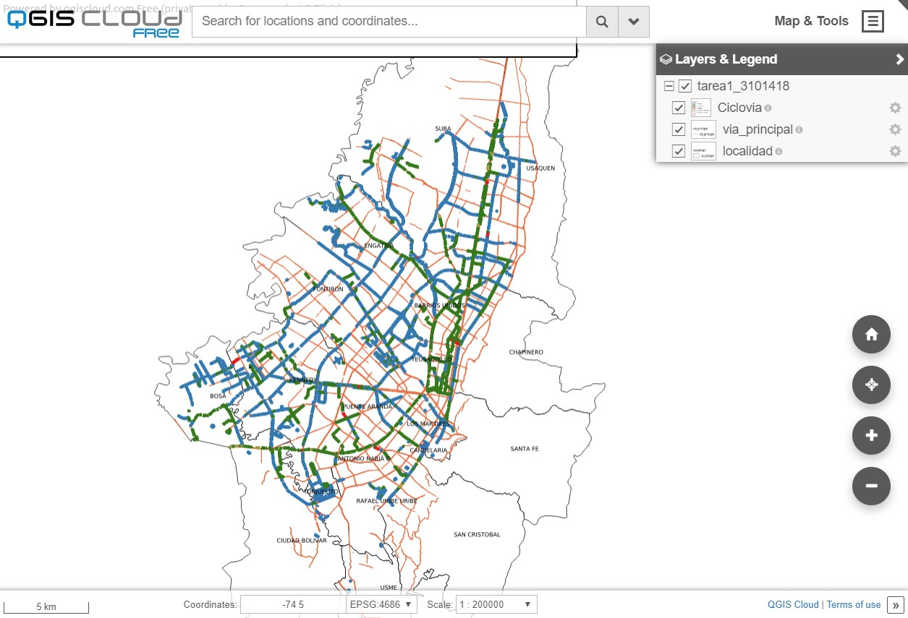

## Segunda Publicación
- Para esta publicación, se usan las capas de localidad y poligonos puntos calientes (Hot Spot) resultantes de una capa de puntos relacionados con eventos de remoción en masa en la ciudad de Bogotá.

## Criterios de clasificación

Para determinar la gama de colores, se determinó usar: Clasificación Graduada, Columna Gi_Bin, El modo usado fué Rupturas naturales (natural breaks) y los colores se usó una gama desde el azul oscuro para las zonas menos afectadas hasta el Rojo para sectores con mayor frecuencia de eventos de remoción.

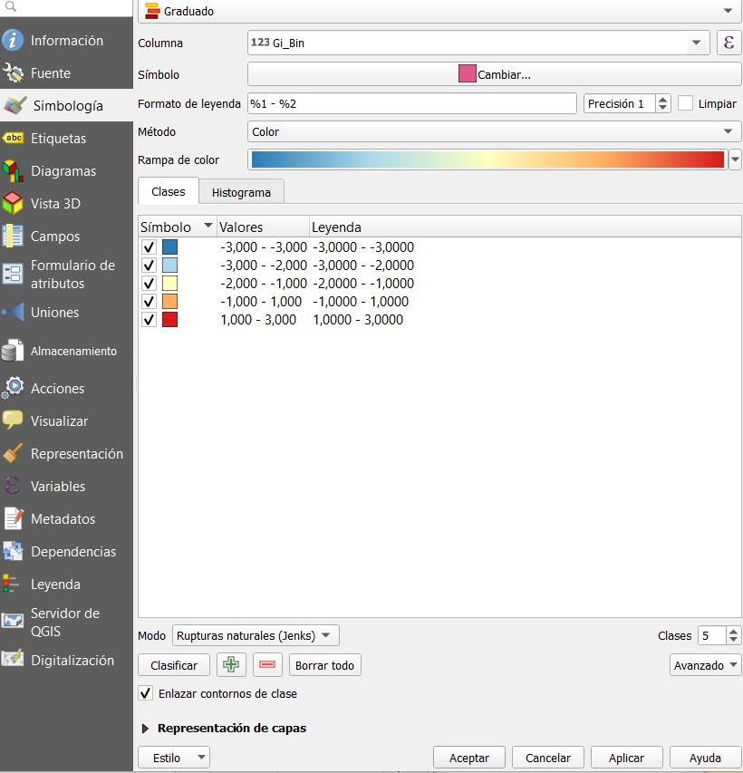

- Se procede a la carga de estos archivos a través de QGis Cloud:

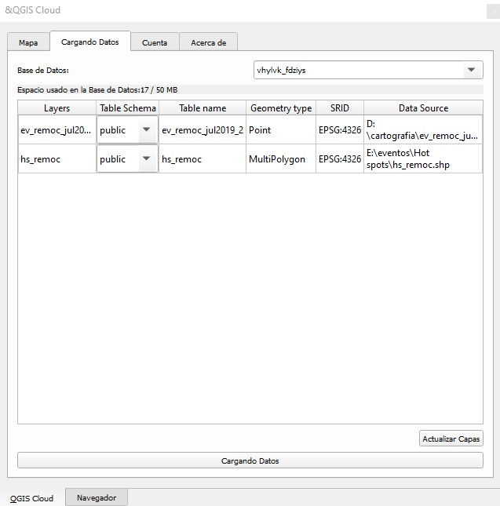

- Posteriormente se publica:

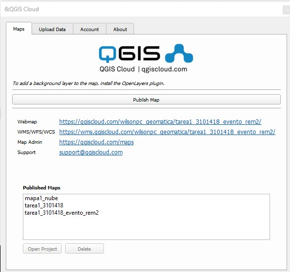

- La publicación se verá de la siguiente manera:

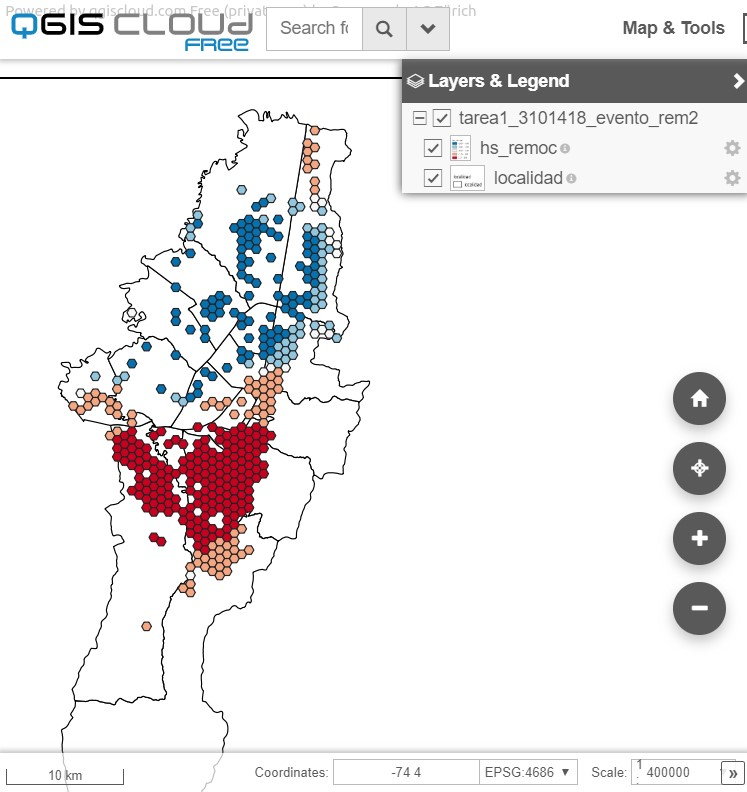

##  Urls

- Mapa Web Clicovias
https://qgiscloud.com/wilsonpc_geomatica/tarea1_3101418/?bl=&st=&l=localidad%2Cvia_principal%2CCiclovia&t=tarea1_3101418&e=-74.19761%2C4.58665%2C-74.00573%2C4.71724

- Mapa web Hot Spot de eventos de remoción.
https://qgiscloud.com/wilsonpc_geomatica/tarea1_3101418_evento_rem2/?bl=&st=&l=localidad%2Chs_remoc&t=tarea1_3101418_evento_rem2&e=-0.00017%2C-0.00008%2C0.00017%2C0.00008

