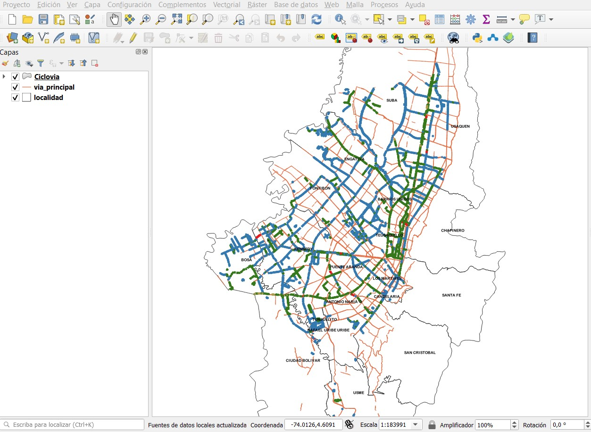
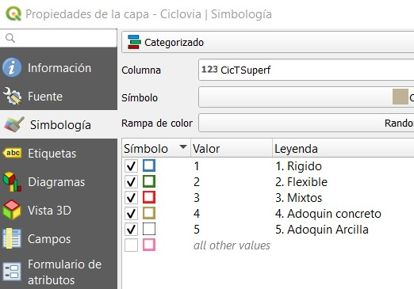

## Descripción

Mapa de donde se muestran los trazados de las ciclo rutas de la ciudad de Bogotá, describiendo el tipo de material en el que está hecha

##  Cuál es el problema a tratar?

Ubicación de ciclorutas de toda la ciudad, ubicando localidades de la ciudad, vias principales y sectores donde se ubican las cilorutas según el material de lo que están hechas. 

##  Por qué un mapa ayuda a resolverlo?

Mediante la ubicación geográfica es fundamental para la mayoría de las actividades humanas. En este caso, el uso de un mapa que permita mostar donde hay ciclorutas, permite a los ciclistas identificar las mejores rutas para llegar a sus destinos. Esto redunda en mejora de la calidad de vida, mejora el ambiente porque evita que algunos ciudadanos usen vehículos de combustión interna.

## Fuente de datos

Datos abiertos Bogotá: shapefiles obtenidos de la gdb de IDECA.

##  Herramientas

- Arcgis
- QGIS
- QgisCloud

##  Proceso Realizado

- Se creó cuenta gratuita en QgisCloud https://qgiscloud.com/
- En QGIS se instaló del plugin de qgiscloud
- Una vez obtenidas las capas en formato shape, se cargan en Qgis 3x.

- Se procede a configurar la simbología de la capa de ciclo rutas.

- Se configuró simbología a través de clasificación categórica por atributo único.

- Mapa resultante:

- Se realizó la publicación del mapa en la web utilizando QgisCloud

##  Urls

- Mapa Web 
https://qgiscloud.com/wilsonpc_geomatica/tarea1_3101418/?bl=&st=&l=localidad%2Cvia_principal%2CCiclovia&t=tarea1_3101418&e=-74.19761%2C4.58665%2C-74.00573%2C4.71724

